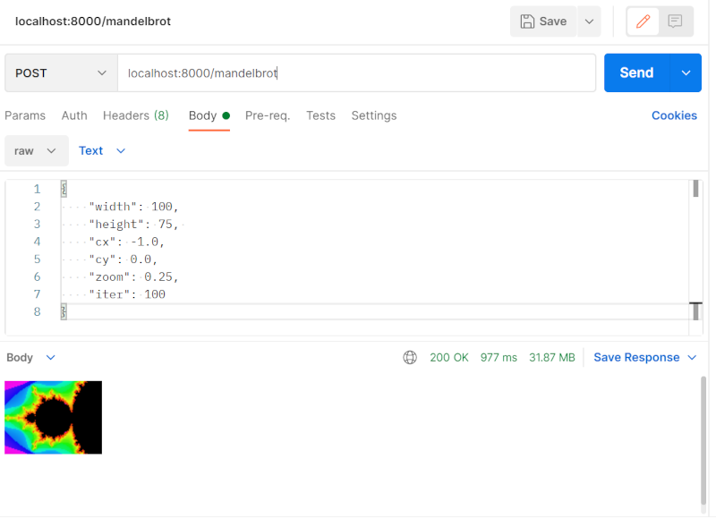

# fractal-pyrs

This is an example of using a Rust crate as a Python module. This project uses the fractal-rs project as an external crate.

# Building

Set up a virtual environment in the project directory:

    python -m venv .venv

Actvate the virtual environment and install the dependencies:

    (.venv) > pip install fastapi aoifiles maturin

Build the Rust python module using maturin with the virtual environment activated:

    (.venv) > cd fractal_pyrs
    (.venv) > maturin develop --release
    (.venv) > cd ..

The maturin command will compile the Rust module and install it in the active virtual environment. For more information see [maturin](https://github.com/PyO3/maturin).

Run the web service using fastapi and uvicorn

    (.venv) > uvicorn main:app --reload 

You can use postman at this point to request a fractal if the image size is small:

